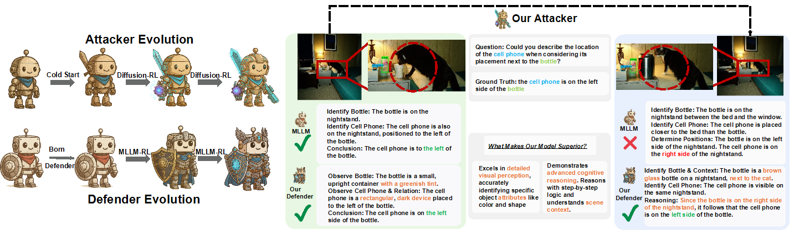
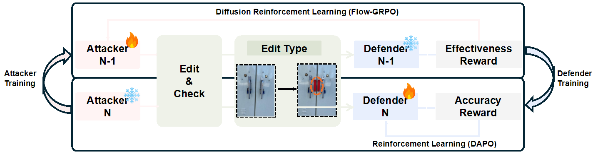

<h2 align="center">
  Dynamic Adversarial Reinforcement Learning for Robust Multimodal Large Language Models
</h2>

<p align="center">
  <a href="https://huggingface.co/chisato111/AOT-Qwen2.5-VL-7B-Instruct"></a>
  <a href="https://opensource.org/licenses/Apache-2.0"></a>
  <a href="https://arxiv.org/abs/2602.22227"></a>
</p>

# 🤗 Overview

<p align="center">
  
</p>

**✨ Key Contributions:**

* **The AOT-SFT Dataset:** A large-scale, structured adversarial dataset designed to bootstrap MLLM robustness. It features paired clean and adversarially manipulated high-resolution images, created via a rigorous scene extension and distractor implantation pipeline.
* **Adversarial Opponent Training (AOT):** A novel self-play framework that shifts the training paradigm from static datasets to autonomous data generation. It co-evolves an image-editing Attacker and a Defender MLLM.
* **Strong Empirical Results:** Significantly enhances perceptual robustness (e.g., +9.24 points on VStar, +8.26 points on HRBench-4K), reduces model hallucinations, and preserves general multimodal capabilities without catastrophic forgetting.

🧠 **Co-evolving Attacker & Defender:** Direct manipulation of visual semantics (images) to probe fine-grained spatial perception.

🎯 **Dynamic Curriculum:** The Attacker autonomously discovers diverse attack strategies (object addition, removal, replacement, and hybrid edits).

🔄 **Dual Policy Optimization:** Flow-GRPO for the diffusion-based Attacker and DAPO for the MLLM Defender.

🧪 **Semantic Integrity Assurance:** Localized SSIM checks guarantee that generated visual attacks are valid and do not corrupt the core objects relevant to the reasoning task.

# 📒 Method

<p align="center">
  
</p>

AOT operates through an initial bootstrapping phase followed by a continuous, iterative co-evolution loop:

**Phase 1: Bootstrapping & Dataset Generation (AOT-SFT)**
* **Stage 1 - Scene Extension:** Outpainting source images to increase visual complexity, thoroughly validated via MLLM-driven Composition, Duplication, and Realism checks.
* **Stage 2 - Adversarial Implantation:** Strategically injecting semantic distractors into validated scenes. Effective distractors that successfully mislead a base MLLM are curated to solve the cold-start problem for the Attacker.

**Phase 2: Iterative Co-evolution**
* **Attacker Evolution (Flow-GRPO):** The image-editing Attacker is refined using a composite reward function that balances **Semantic Integrity** (ensured by localized SSIM) and **Adversarial Efficacy** (causing consecutive reasoning failures in the Defender).
* **Defender Enhancement (DAPO):** The updated Attacker generates a new, highly curated curriculum of challenging examples. The Defender MLLM is then updated via Reinforcement Learning (DAPO) with format and accuracy rewards to build resilience against these novel visual attacks.

## 🛠 Getting Started

### Environment Setup

```bash
# Python 3.10+, CUDA 12+
pip install -r requirements.txt

# Install the verl training framework
pip install -e verl/
```

### Training

We use a 4-stage pipeline: one base warm-up stage followed by three co-evolutionary iterations.

**1. Set environment variables**

```bash
export MODEL_PATH=/path/to/Qwen2.5-VL-7B-Instruct  # or your resized model
export DATA_DIR=/path/to/training_data
export CHECKPOINT_DIR=/path/to/save/checkpoints
```

**2. Base training (warm-up)**

```bash
bash scripts/run_base.sh
```

**3. Adversarial co-evolutionary iterations**

Run iterations sequentially, each loading the checkpoint from the previous stage:

```bash
bash scripts/run_iter0.sh
bash scripts/run_iter1.sh
bash scripts/run_iter2.sh
```

Training configs are in `scripts/config/`. Key hyperparameters:
- `algorithm.disable_kl=True` — disables KL penalty (DAPO-style)
- `algorithm.online_filtering=True` — filters groups with trivial reward signals
- `worker.actor.clip_ratio_low/high` — asymmetric PPO clipping

### Evaluation

All evaluation scripts use a [vLLM](https://github.com/vllm-project/vllm) server. Start the server first:

```bash
vllm serve /path/to/your/model --port 25556
```

Then run the desired benchmark from the `eval/` directory:

```bash
cd eval

# Hallucination benchmarks
python hallucination/hallusionbench.py --model_identifier your_model_name --dataset_path /path/to/HallusionBench.tsv
python hallucination/pope.py --model_identifier your_model_name --dataset_path /path/to/POPE.tsv

# High-resolution benchmarks
python high_resolution/hrbench4k.py --model_identifier your_model_name --dataset_path /path/to/hr_bench_4k_local.tsv
python high_resolution/hrbench8k.py --model_identifier your_model_name --dataset_path /path/to/hr_bench_8k_local.tsv
python high_resolution/vstarbench.py --model_identifier your_model_name --dataset_path /path/to/VStarBench
```

Each script writes results to `eval/output/<BENCHMARK_NAME>/`. The prompt templates used for evaluation are configured in `eval/config/prompts.toml`.

## 📂 Repository Structure

```
├── eval/
│   ├── config/
│   │   └── prompts.toml          # prompt templates for evaluation
│   ├── hallucination/            # AMBER, HallusionBench, MME, POPE, VSR
│   └── high_resolution/          # HRBench-4K/8K, MME-RealWorld(-Lite), TreeBench, VStarBench
├── figures/                      # paper figures
├── scripts/
│   ├── config/                   # YAML training configs
│   ├── reward/
│   │   └── correct_first.py      # MCQ reward function
│   ├── run_base.sh               # base training stage
│   ├── run_iter0.sh              # adversarial iteration 0
│   ├── run_iter1.sh              # adversarial iteration 1
│   └── run_iter2.sh              # adversarial iteration 2
├── verl/                         # RL training framework (EasyR1)
├── requirements.txt
└── README.md
```

## Citation

```bibtex
@article{bao2026dynamic,
  title={Dynamic Adversarial Reinforcement Learning for Robust Multimodal Large Language Models},
  author={Bao, Yicheng and Wang, Xuhong and Zhang, Qiaosheng and Lu, Chaochao and Hu, Xia and Tan, Xin},
  journal={arXiv preprint arXiv:2602.22227},
  year={2026}
}
```